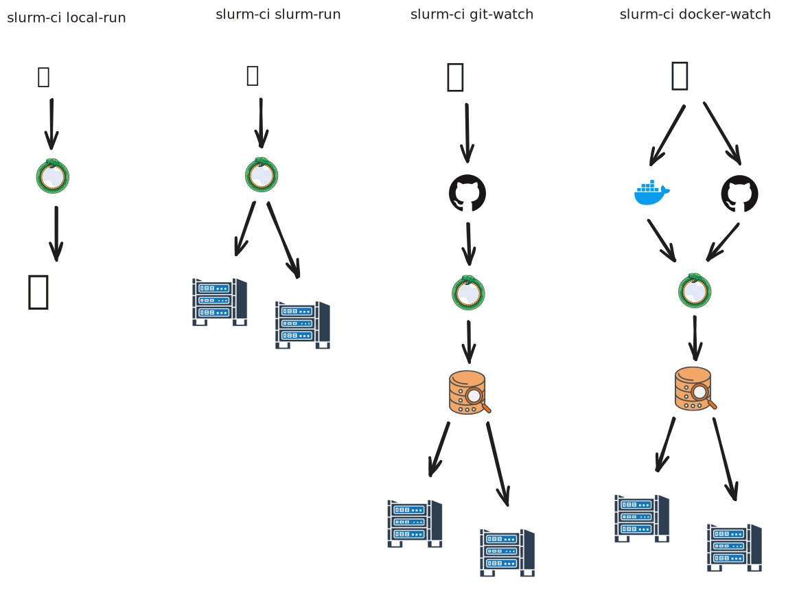

# slurm-ci

:construction: **This project is under active development and is not yet ready for production use.**
:construction: **Not all tests are working yet.**

`slurm-ci` is a tool for running GitHub Actions workflows on a Slurm cluster. It provides a bridge between the local development environment and a high-performance computing (HPC) environment, allowing you to test and run your CI pipelines with the power of Slurm.

## Overview


## Commands

### `local-run`

The `local-run` command is a convenient wrapper around the `act` tool, allowing you to execute your GitHub Actions workflows locally. This is useful for testing and debugging your workflows before submitting them to the Slurm cluster.

**Usage:**

```bash
slurm-ci local-run [act arguments]
```

All arguments passed to `local-run` are forwarded directly to `act`. For more information on the available arguments, please refer to the `act` documentation.

**Example:**

```bash
slurm-ci local-run --job my-test-job
```

### `slurm-run`

The `slurm-run` command allows you to submit your GitHub Actions workflows to a Slurm cluster. It can be used in three different ways:

**1. Using command-line arguments:**

You can specify the workflow file and working directory directly on the command line.

**Usage:**

```bash
slurm-ci slurm-run --workflow_file <path_to_workflow> --working_directory <path_to_project>
```

**Example:**

```bash
slurm-ci slurm-run --workflow_file .github/workflows/main.yml --working_directory .
```

**2. Using a configuration file:**

For more complex configurations, you can use a TOML configuration file to specify the workflow, working directory, and any custom Slurm options.

**Usage:**

```bash
slurm-ci slurm-run --config <path_to_config.toml>
```

**Example `slurm-run-config.toml`:**
```toml
[slurm-ci]
workflow_file = ".github/workflows/main.yml"
working_directory = "."

[slurm-ci.slurm]
gres = "gpu:gfx942"
cpus-per-task = 32
time = "12:00:00"
```

**3. Generating a configuration template:**

You can generate a template configuration file to get started quickly.

**Usage:**

```bash
slurm-ci slurm-run --generate-template
```

This will create a `slurm-run-config.toml` file in your current directory with the default options, which you can then customize to your needs.

### `git-watch`

The `git-watch` command allows you to monitor a Git repository for new commits and automatically trigger `slurm-run` jobs. It runs as a daemon process and can be managed with the following subcommands:

**1. Create a configuration file:**

Before starting a `git-watch` daemon, you need to create a configuration file.

**Usage:**

```bash
slurm-ci git-watch create-config --output <path_to_config.toml>
```

**Example `git-watch-config.toml`:**

```toml
[daemon]
name = "my-project-main"
polling_interval = 300

[repository]
url = "https://github.com/user/repo"
branch = "main"
github_token = "optional_for_private_repos"

[slurm-ci]
config_dir = "/path/to/slurm-ci-configs"
working_directory = "/path/to/working-directory"
workflow_file = "workflows/ci.yml"

[slurm-ci.slurm]
gres = "gpu:gfx942"
"cpus-per-task" = 32
time = "12:00:00"
partition = "gpu"
```

**2. Start a daemon:**

**Usage:**

```bash
slurm-ci git-watch start --config <path_to_config.toml>
```

**3. Stop a daemon:**

**Usage:**

```bash
slurm-ci git-watch stop <daemon_name>
```

**4. Stop all daemons:**

**Usage:**

```bash
slurm-ci git-watch stop-all
```

**5. Check daemon status:**

**Usage:**

```bash
slurm-ci git-watch status
```

